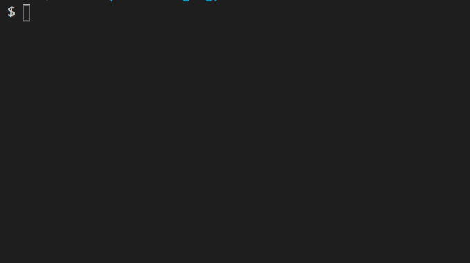

# 🏗️ Build CLI App with Inquirer

Work with a partner to implement the following user story:

* As a developer, I want to create a command-line application that takes in input from the user and does something with it.

## Acceptance Criteria

* It's done when I have initialized my repository with a `package.json` file by running `npm init -y`.

* It's done when I have installed inquirer and added it to my list of dependencies by running `npm i inquirer --save`.

* It's done when the application asks the user, "What is your name?"
  
* It's done when the application asks the user, "What languages do you know?"

* It's done when the application asks the user, “What is your preferred method of communication?"

* It's done after I have written those responses to a file.

## Screenshot



## 💡 Hints

Why do we need to use `JSON.stringify`? How can we use the npm page for `inquirer` to see how to use checkboxes and lists? 

## Example Output File Contents

```json
{
  "name": "Biff",
  "stack": ["HTML", "CSS", "JavaScript"],
  "contact": "telekinesis"
}
```

## 💡 Hints

* Why do we need to use `JSON.stringify`?

* Use a **checkbox** question type for languages to allow users to choose more than one item from a list.

* Use a **list** questing type for communication method to allow users to choose only one item from a list.

* How can we use the npm page for `inquirer` to see how to use **checkboxes** and lists?

## 🏆 Bonus

If you have completed this activity, work through the following challenge with your partner to further your knowledge:

* How would you format your JSON? Can you generate the name of your user file from the user input?

Use [Google](https://www.google.com) or another search engine to research this.

---

© 2022 Trilogy Education Services, LLC, a 2U, Inc. brand. Confidential and Proprietary. All Rights Reserved.