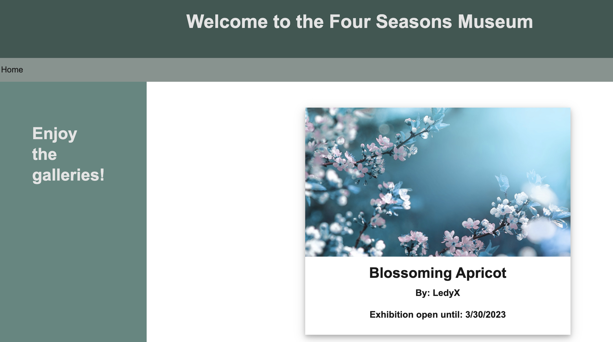

# 🐛 Date Is Not Formatted Correctly

Work with a partner to resolve the following issues:

* Museum visitors should be able to see the end date of each painting on the painting page.

## Expected Behavior

* When a museum visitor visits the painting page, it should clearly and accurately show the date that the exhibition will end.

* The end date is calculated by adding five years to the painting's `exhibition_date`.

* The end date should be formatted as `M/D/YYYY`.

## Actual Behavior

When a museum visitor visits the exhibition page, it shows the painting's `exhibition_date` in the original long timestamp format.

## Instructions

1. Copy `.env.EXAMPLE` to `.env` and add your MySQL credentials. (Run `cp .env.EXAMPLE .env` to make a copy.)

2. Run `npm install` to install packages.

3. Run `npm run seed` to seed the database.

4. Open your browser to `http://localhost:3001/painting/1` to see the painting details render the incorrectly displayed end date.

5. Read the hints below.

6. Update `utils/helpers.js` and `views/painting.handlebars` to fix the painting view.

## Assets

The following image demonstrates the correct formatting of the end date for each painting:

---

## 💡 Hints

Which JavaScript Date methods allow you to return the month, date, and year of a specified date? How do you correctly render the month, considering that it is returned as a zero-based value?

## 🏆 Bonus

If you have completed this activity, work through the following challenge with your partner to further your knowledge:

* What other data can be formatted by custom helpers?

Use [Google](https://www.google.com) or another search engine to research this.

---
© 2022 Trilogy Education Services, LLC, a 2U, Inc. brand. Confidential and Proprietary. All Rights Reserved.