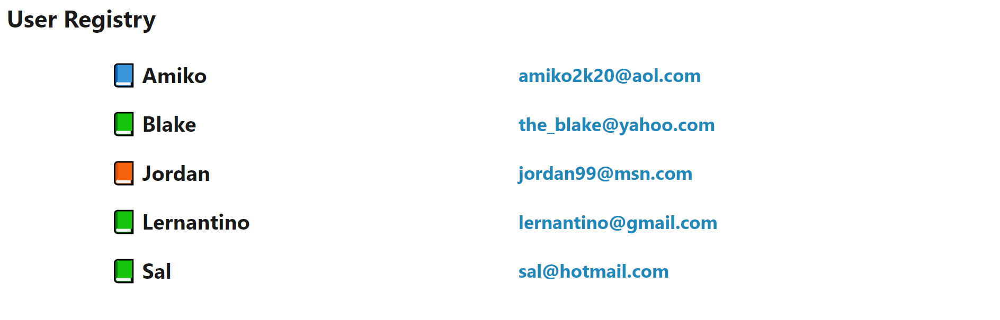

# 🏗️ Populate User Registry with Database Data

Work with a partner to implement the following user story:

* As a user, I want to see a list of other users who are registered with the app.

## Acceptance Criteria

* It's done when the homepage displays the user data from the database instead of the hardcoded values.

* It's done when the user data is rendered as part of a Handlebars.js template.

* It's done when the users are sorted alphabetically by name.

## Instructions

1. Copy `.env.EXAMPLE` to `.env` and add your MySQL credentials. (Run `cp .env.EXAMPLE .env` to make a copy.)

2. Run `mysql -u root -p < db/schema.sql` to create the database schema. 

3. Run `npm install` to install packages.

4. Run `npm run seed` to seed the database.

5. Read the hints.

6. Update `controllers/homeRoutes.js` and `views/homepage.handlebars` to complete the acceptance criteria. 

## Assets

The following image demonstrates the web application's appearance and functionality:

---

## 💡 Hints

Without a signup form, how can you quickly add new users to the database? What needs to happen with the Sequelize data before it can be passed into the Handlebars.js template?

## 🏆 Bonus

If you have completed this activity, work through the following challenge with your partner to further your knowledge:

* What are some other paradigms besides MVC?

Use [Google](https://www.google.com) or another search engine to research this.

---
© 2022 Trilogy Education Services, LLC, a 2U, Inc. brand. Confidential and Proprietary. All Rights Reserved.
